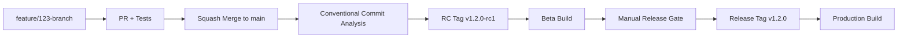

# Trunk-Based Release System

## Overview

This document describes a fully automated trunk-based development and release workflow using conventional commits, GitHub Actions, and manual release gates. The system provides controlled, predictable releases while maintaining development velocity through trunk-based development.

## Core Principles

- **Single Long-Standing Branch**: Only `main` exists permanently
- **Feature Branches**: Short-lived branches for all work (`feature/123-description`)
- **Squash Merges**: All PRs squash merge to main with conventional commit messages
- **Automated Versioning**: Semantic versioning based on conventional commit analysis
- **Release Gates**: Manual approval between RC and production release
- **Issue Tracking**: Every commit and PR tied to GitHub issues

## Workflow Overview



## Branch Naming Convention

### Required Pattern
```
(feature|hotfix|epic)/{issue-number}-{description}
```

### Examples
- `feature/123-add-user-authentication`
- `hotfix/456-fix-memory-leak`
- `epic/789-redesign-dashboard`

### Validation
- GitHub Actions validates branch names on PR creation
- Commit hook extracts issue numbers automatically
- PR titles must start with issue number

## Conventional Commits & Versioning

### Commit Types & Version Impact

| Commit Type | Version Bump | Example |
|-------------|--------------|---------|
| `fix:` | Patch (1.2.0 → 1.2.1) | `fix: resolve memory leak in parser` |
| `feat:` | Minor (1.2.0 → 1.3.0) | `feat: add user authentication` |
| `feat!:` or `BREAKING CHANGE:` | Major (1.2.0 → 2.0.0) | `feat!: remove deprecated API endpoints` |
| `perf:` | Patch | `perf: optimize database queries` |

### Breaking Changes
- Use `feat!:` or `fix!:` for breaking changes
- Add `BREAKING CHANGE:` in commit body for detailed description
- PR template includes breaking change checkbox and description fields

## Release Pipeline

### Phase 1: Development
1. Create branch: `feature/123-description`
2. Local commits auto-prefixed with `#123: ` by commit hook
3. Push triggers CI validation (tests, linting, branch naming)
4. Create PR with breaking change declaration if needed

### Phase 2: Integration  
1. PR review and approval
2. Squash merge to main with conventional commit message
3. Conventional commit analysis determines version bump type
4. Automatic RC tag creation (e.g., `v1.2.0-rc1`)

### Phase 3: Release Candidate
1. RC tag triggers beta build pipeline
2. Cross-platform binaries built with beta flags
3. RC artifacts uploaded for testing
4. Pipeline waits at **release-approval** environment gate

### Phase 4: Production Release
1. Manual approval in GitHub Environment triggers release creation
2. Release tag created from same commit as RC (e.g., `v1.2.0`)
3. Production build pipeline generates final release binaries
4. GitHub Release created with changelog and artifacts

## GitHub Actions Workflows

### Core Workflows

1. **`ci.yml`** - Branch validation, testing, cross-platform builds
2. **`trunk-release.yml`** - RC creation, manual gate, release promotion
3. **`auto-squash.yml`** - Conventional commit generation from PR metadata

### Environment Configuration

**`release-approval` Environment:**
- Required reviewers: Release managers/team leads
- Deployment protection: main branch only
- Manual approval required for release promotion

## Commit Hook Integration

### Installation
```bash
# Use existing PowerShell hook (recommended)
cp D:\resources\commit-msg-hook.ps1 .git\hooks\commit-msg
chmod +x .git\hooks\commit-msg

# Or bash version for Unix-only environments
cp D:\resources\commit-msg-hook.sh .git\hooks\commit-msg  
chmod +x .git\hooks\commit-msg
```

### Functionality
- Automatically extracts issue number from branch name
- Prepends `#123: ` to all commit messages
- Skips main branch and merge commits
- Provides clear feedback and warnings

## PR Template & Breaking Changes

### Breaking Change Process
1. Check "This PR contains breaking changes" in PR template
2. Fill out breaking change description and migration guide
3. Squash merge automatically generates `feat!:` commit
4. Results in major version bump (1.2.0 → 2.0.0)

### PR Template Sections
- Change type classification (bug fix, feature, etc.)
- Breaking change declaration and description
- Migration guide for breaking changes
- Testing and review checklists

## Build Artifacts

### RC Builds (Beta)
- Version: `v1.2.0-rc1`
- Build flags: `-X cmd.BuildType=beta`
- Artifacts: Cross-platform binaries for testing
- Purpose: Pre-release validation

### Release Builds (Production)
- Version: `v1.2.0`
- Build flags: `-X cmd.BuildType=release`  
- Artifacts: Final production binaries
- Purpose: End-user distribution

## Manual Promotion Process

### RC to Release Promotion
1. RC builds and testing completed
2. Navigate to GitHub Actions → Environments → release-approval
3. Review RC artifacts and test results
4. Click "Approve deployment" 
5. Release tag created automatically
6. Production build pipeline triggered

### Emergency Hotfixes
1. Create hotfix branch: `hotfix/999-critical-security-fix`
2. Follow standard PR process with `fix:` conventional commit
3. Results in patch version bump: 1.2.0 → 1.2.1
4. Same RC → Release promotion process

## Benefits

### Automation
- Zero manual version management
- Automatic changelog generation
- Consistent release artifacts
- Predictable release cadence

### Quality Gates
- Comprehensive CI validation
- Manual release approval
- Issue tracking integration
- Breaking change documentation

### Developer Experience  
- Simple branch naming convention
- Automatic issue number injection
- Clear PR templates and guidelines
- Minimal manual release overhead

## Implementation Checklist

- [ ] Install commit hooks (`commit-msg-hook.ps1`)
- [ ] Update GitHub Actions workflows
- [ ] Create `release-approval` environment
- [ ] Configure branch protection rules on main
- [ ] Train team on conventional commit format
- [ ] Test RC → Release promotion flow
- [ ] Document breaking change migration process

## Troubleshooting

### Common Issues

**Branch validation fails:**
- Check branch naming: `(feature|hotfix|epic)/{number}-{description}`
- Ensure issue number exists in GitHub

**RC not created:**  
- Verify conventional commit format in squash merge
- Check if commit type triggers release (feat, fix, perf)

**Release gate stuck:**
- Check `release-approval` environment reviewers
- Verify required approvals are provided

**Build artifacts missing:**
- Check Go version compatibility (1.21+)
- Verify cross-platform build matrix

### Support Resources

- Conventional Commits: https://conventionalcommits.org/
- GitHub Environments: https://docs.github.com/en/actions/deployment/environments
- Semantic Versioning: https://semver.org/

---

*This system provides fully automated, trunk-based development with controlled release promotion and comprehensive quality gates.*